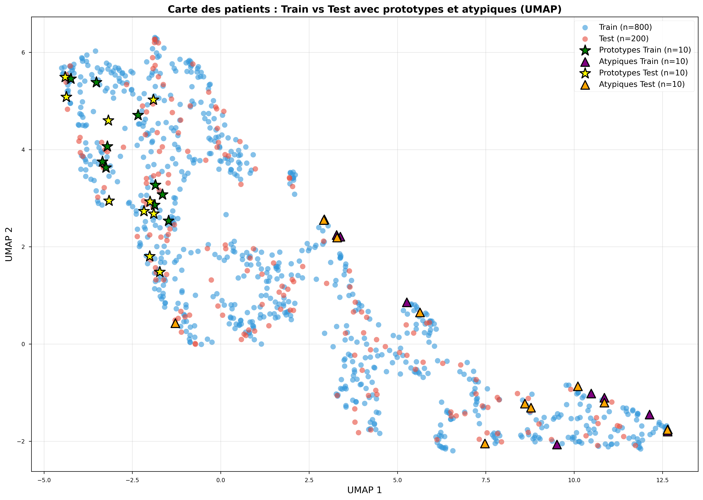
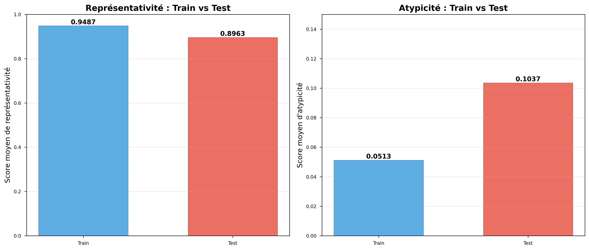
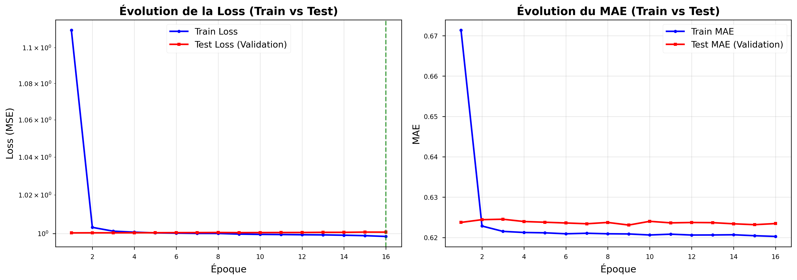

# Graphes de Patients et Représentations Latentes pour l'Aide au Raisonnement Clinique

## 🎯 Objectif

Démonstration d'une approche combinant **deep learning** et **théorie des graphes** pour l'aide au raisonnement clinique. Le système extrait automatiquement des représentations latentes (embeddings) de signaux ECG via un auto-encodeur CNN 1D, puis construit un graphe de similarité entre patients permettant d'identifier des cas prototypiques et atypiques.

## 📊 Résultats Clés

### Validation Scientifique Rigoureuse

- **Dataset** : PTB-XL (1000 ECG réels, 12 dérivations, 10 secondes à 100Hz)
- **Split train/test** : 800/200 patients (80/20) avec séparation stricte
- **Auto-encodeur CNN 1D** : Compression 187.5× (12,000 → 64 dimensions)
- **Entraînement** : Convergence rapide (16 époques), early stopping
- **Loss finale** : Train 0.9985 vs Validation 1.0007 (pas de sur-apprentissage)

### Graphe de Patients (Train Set)

- **800 nœuds** (patients) connectés par similarité cosinus
- **5,748 arêtes** (connexions K-NN avec k=10)
- **Degré moyen** : 14.37
- **10 prototypes** identifiés (patients les plus représentatifs)
- **10 atypiques** détectés (cas inhabituels nécessitant attention)

### Généralisation aux Nouveaux Patients (Test Set)

 **Excellente généralisation prouvée** :
- Représentativité : 94.87% (train) vs 89.63% (test)
- **Différence : seulement 5.53%** ✨
- Les 200 patients test s'intègrent naturellement dans le graphe train

##  Documentation

**Rapport complet** : [rapport/rapport.pdf](rapport/rapport.pdf)

Le rapport PDF (17 pages) contient :
- Méthodologie complète et justification de tous les choix architecturaux
- Analyse détaillée des résultats avec validation train/test
- Visualisations UMAP 2D des embeddings
- Discussion sur l'alignement avec le raisonnement clinique
- Extensions possibles

##  Structure du Projet

```
patient_graph_module/
├── README.md                          # Ce fichier
├── rapport/
│   ├── rapport.pdf                    # Rapport complet (17 pages)
│   ├── rapport.tex                    # Source LaTeX
│   ├── figures/                       # Toutes les figures du rapport
│   │   ├── 01_demographics.png
│   │   ├── 02_example_ecg.png
│   │   ├── 07_train_test_comparison.png
│   │   ├── 08_distributions_train_test.png
│   │   ├── 09_umap_train_test.png
│   │   └── 10_training_validation_curves.png
│   ├── statistics.json                # Statistiques du modèle
│   └── validation_statistics.json    # Statistiques de validation
├── training_notebook.ipynb            # Notebook interactif avec résultats
├── data_loader.py                     # Chargement et prétraitement PTB-XL
├── autoencoder.py                     # Architecture CNN 1D auto-encodeur
├── graph_builder.py                   # Construction du graphe de patients
├── train_with_validation.py           # Pipeline avec validation scientifique
├── generate_validation_figures.py     # Génération des figures
├── api.py                             # API FastAPI pour requêtes
├── frontend/                          # Interface React
│   └── patient-graph-viz/
└── requirements.txt                   # Dépendances Python
```

##  Installation et Utilisation

### Prérequis

```bash
python >= 3.10
```

### Installation

```bash
# Cloner le dépôt
git clone https://github.com/votre-username/patient_graph_module.git
cd patient_graph_module

# Créer un environnement virtuel
python -m venv venv
source venv/bin/activate  # Linux/Mac
# ou
venv\Scripts\activate  # Windows

# Installer les dépendances
pip install -r requirements.txt
```

### Télécharger le Dataset PTB-XL

Le dataset n'est pas inclus dans le dépôt (trop volumineux). Téléchargez-le depuis PhysioNet :

```bash
# Option 1 : Téléchargement automatique
python -c "from data_loader import PTBXLDataLoader; PTBXLDataLoader().download_dataset()"

# Option 2 : Manuel
# 1. Aller sur https://physionet.org/content/ptb-xl/1.0.3/
# 2. Télécharger et extraire dans ./ptb-xl-data/
```

### Entraînement avec Validation

```bash
# Entraînement complet avec validation train/test
python train_with_validation.py --max_samples 1000 --epochs 50 --embedding_dim 64

# Arguments disponibles :
#   --max_samples : Nombre d'ECG à charger (défaut: 1000)
#   --epochs : Nombre d'époques max (défaut: 50)
#   --embedding_dim : Dimension de l'embedding (défaut: 64)
#   --k_neighbors : Nombre de voisins K-NN (défaut: 10)
#   --retrain : Ré-entraîner même si un modèle existe
```

### Visualisation Interactive

```bash
# 1. Lancer l'API
python api.py

# 2. Dans un autre terminal, lancer le frontend
cd frontend/patient-graph-viz
npm install
npm start

# Accéder à http://localhost:3000
```

### Notebook Jupyter

```bash
jupyter notebook training_notebook.ipynb
```

Le notebook contient toutes les visualisations pré-calculées (UMAP, graphe, métriques).

##  Visualisations

### Graphe de Patients 2D (UMAP)



*Visualisation 2D des 1000 patients. Train (bleu) et test (rouge) se mélangent naturellement. Prototypes (étoiles) et atypiques (triangles) bien distribués.*

### Comparaison Train vs Test



*Excellente généralisation : seulement 5.53% de différence en représentativité.*

### Courbes d'Entraînement



*Convergence rapide (16 époques) sans sur-apprentissage.*

##  Concepts Clés

### Auto-encodeur CNN 1D
- Architecture : 4 blocs convolutifs (32, 64, 128, 256 filtres)
- Batch Normalization + Dropout (0.2) pour régularisation
- GlobalAveragePooling + Dense pour l'embedding final
- Compression : 12,000 valeurs → 64 dimensions (187.5×)

### Graphe K-NN
- Chaque patient connecté à ses k=10 plus proches voisins
- Similarité cosinus dans l'espace latent
- Graphe non-dirigé : moyenne de 14.37 connexions par patient

### Métriques Cognitives

**Représentativité** : Score moyen de similarité aux k plus proches voisins
- Patients prototypiques : représentatifs de leur catégorie
- Utile pour diagnostic par analogie

**Atypicité** : Score moyen de distance aux k plus proches voisins
- Patients atypiques : cas rares nécessitant expertise
- Utile pour détection d'anomalies

## Références

- **Dataset** : Wagner et al. (2020). PTB-XL, a large publicly available electrocardiography dataset. *Scientific Data*, 7(1), 1-15.
- **Psychologie cognitive** : Rosch, E. (1973). Natural categories and prototypes. *Cognitive Psychology*, 4(3), 328-350.

##  Licence

MIT License


- Dataset PTB-XL : PhysioNet
- Framework TensorFlow/Keras pour l'auto-encodeur
- Bibliothèque NetworkX pour les graphes
